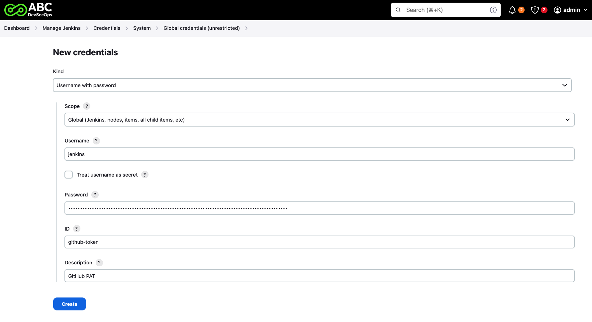
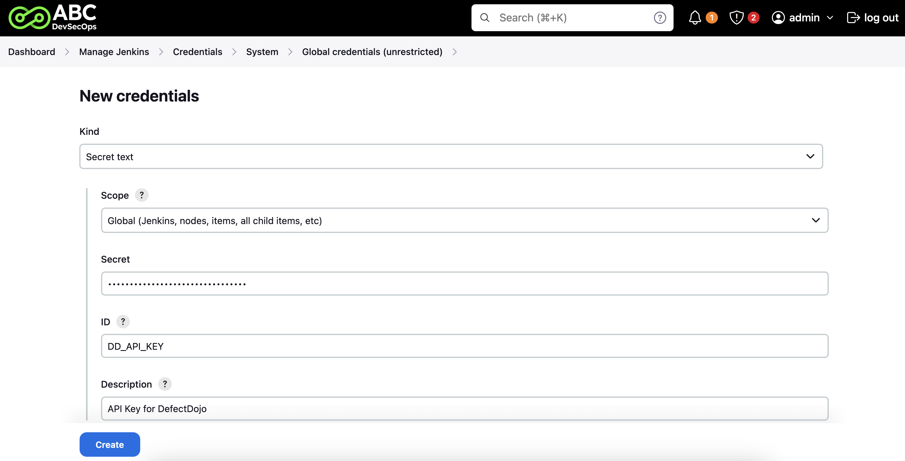
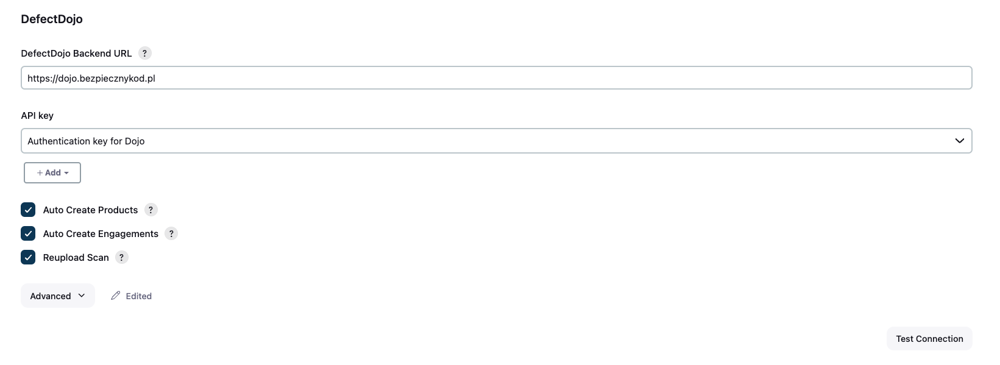

# Konfiguracja połączenia z GitHub / DefectDojo

## Fork repozytorium

W ramach ABCD wszystkie narzędzia będą uruchamiane w ramach testowej aplikacji `Juice Shop`. Repozytorium z aplikacją `abcd-student` znajdziesz [tutaj](https://github.com/Bezpieczny-Kod/abcd-student) (zforkuj je do siebie).

## GitHub

Aby Jenkins mógł klonować repozytorium z naszą testową aplikacją `Juice Shop` potrzebujemy wygenerować Personal Access Token (PAT), który będzie uwierzytelniał operację klonowania po HTTPS.

Przejdź w ustawieniach GitHuba na [Settings / Developer Settings / Tokens](https://github.com/settings/tokens?type=beta) i wybierz opcję "Generate new token".
1. **Repository access** - wybierz opcję "Only selected repositories" i wskaż zforkowane repozytorium z aplikacją testową.
2. **Repository permissions** -  znajdź uprawnienie "Contents" i ustaw na "Read-only".
3. Klilnij "Generate token"
4. Skopiuj wygenerowany token (nie zobaczysz go już ponownie!)

## Jenkins

### Dodanie tokenu GitHub PAT
W Jenkins przejdź do ustawień [Dashboard / Manage Jenkins / Credentials / System / Global](http://localhost:8080/manage/credentials/store/system/domain/_/) i kliknij "Add credentials".

- **Kind** - "Username with password"
- **Scope** - "Global..."
- **Username** - nie ma znaczenia, możesz ustawić jako "Jenkins"
- **Password** - tutaj wklejasz wygenerowany wcześniej token z GitHub
- **ID** - tak jak sama nazwa wskazuje - będziesz do niego potem referował w kodzie Twojego pipeline (Jenkinsfile).

### Dodanie klucza API DefectDojo
> [!NOTE]
> W ABC DevSecOps narzędzie DefectDojo jest wykorzystywane tylko do celów administracyjnych związanych z weryfikacją przesłanych zadań. Nie będziesz miał dostępu do platformy, a jedynie do klucza API, który umożliwi przesłanie raportów z narzędzi. **Klucz API znajdziesz na platformie Circle**.

W Jenkins przejdź do ustawień [Dashboard / Manage Jenkins / Credentials / System / Global](http://localhost:8080/manage/credentials/store/system/domain/_/) i kliknij "Add credentials".

- **Kind** - "Secret text"
- **Scope** - "Global..."
- **Secret** - tutaj wklej **klucz API do DefectDojo, który znajdziesz na platformie Circle**
- **ID** - tak jak sama nazwa wskazuje - będziesz do niego potem referował w kodzie Twojego pipeline (Jenkinsfile).

Następnie przejdź do ustawień systemowych [Dashboard / Manage Jenkins / System](http://localhost:8080/manage/configure). Zjedź na sam dół do sekcji **DefectDojo**.

- **DefectDojo URL** - `https://dojo.bezpiecznykod.pl`
- **API Key** - wybierz wcześniej zapisany klucz do DefectDojo
- Zaznacz wszystkie pola "Auto Create Products", "Auto Create Engagements", "Reupload Scan".

Możesz przetestować połączenie, a następnie zatwierdź i zapisz zmiany.