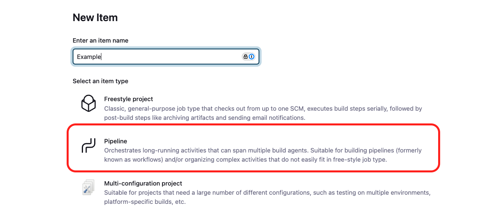

# Uruchomienie pipeline i wysyłanie wyników (zadań)

Będąc na stronie startowej [Dashboard](http://localhost:8080/) kliknij "New item", nazwij swój pipeline według uznania (**UWAGA! Nazwa pipeline nie może zawierać spacji, inaczej będzies zmiał potem problem z kopiowaniem artefaktów**). Jako typ projektu wybierz "Pipeline" i kliknij "Ok".


Wybierz na samym dole **"Pipeline script from SCM"** jako repozytorium podaj adres (po HTTPS) do swojego zforkowanego repozytorium a jako "Credentials" wskaż wcześniej utworzone dane uwierzytelniające zawierają GitHub PAT. Jako ścieżka do Jenkinsfile zostaw po prostu `Jenkinsfile`. Zatwierdź i zapisz zmiany.

W tym momencie przejdź do zforkowanego repozytorium i w pliku deklarującym Twój pipeline `Jenkinsfile` upewnij się, że w kroku `git` masz ustawione odpowiednie wartości:
* credentialsId
* url
* branch

```Jenkinsfile
pipeline {
    agent any
    options {
        skipDefaultCheckout(true)
    }
    stages {
        stage('Code checkout from GitHub') {
            steps {
                script {
                    cleanWs()
                    git credentialsId: 'github-pat', url: 'https://github.com/johndoe/abcd-student', branch: 'main'
                }
            }
        }
        stage('Example') {
            steps {
                echo 'Hello!'
                sh 'ls -la'
            }
        }
    }
}
```
Do pisania pipeline wykorzystuj [declarative syntax](https://www.jenkins.io/doc/book/pipeline/syntax/#declarative-pipeline), który jest bardziej przejrzysty i prostszy.

Po ustawieniu odpowiednich wartości (upewnij się, że zacommitowałeś zmiany do zdalnego repozytorium) możesz uruchomić pipeline za pomocą "Build now". Pierwsze uruchomienie zklonuje repozytorium do przestrzeni roboczej i wykona stage "Example", w którym robimy proste `echo` oraz listujemy zawartość bieżącego katalogu.


## Wysyłanie raportów do DefectDojo
> [!NOTE]
> W ABC DevSecOps narzędzie DefectDojo jest wykorzystywane tylko do celów administracyjnych związanych z weryfikacją przesłanych zadań. Nie będziesz miał dostępu do platformy, a jedynie do klucza API, który umożliwi przesłanie raportów z narzędzi.

Podczas wdrażania narzędzia w pipeline będziesz generował raport z wynikami. Przykład:

```
...
        stage('SCA scan') {
            steps {
                sh 'osv-scanner scan --lockfile package-lock.json --format json --output results/sca-osv-scanner.json'
            }
        }
        post {
            always {
                defectDojoPublisher(artifact: 'results/sca-osv-scanner.json', 
                    productName: 'Juice Shop', 
                    scanType: 'OSV Scan', 
                    engagementName: 'krzysztof@bezpiecznykod.pl')
            }
        }
...
```

Wykorzystujemy plugin `defectDojoPublisher`, który automatycznie będzie korzystał z wcześniej skonfigurowanego połączenia. **Istotne kwestie**:
- `artifact:` ścieżka do zapisanego wyniku (artefaktu)
- `productName:` zawsze ustawiaj na `Juice Shop`
- `scanType:` dobierz typ scanu do narzedzia jakie wdrażasz (tabelka poniżej)
- `engagementName:` **UWAGA: ustaw wartość na swój adres e-mail (dzięki temu będziemy mogli Ciebie zidentyfikować)**

### Typy skanów
> [!WARNING]
> Typ skanu jest "case-sensitive".

| Narzędzie              | Format | `scanType:`           |
|------------------------|--------|-----------------------|
| Zed Attack Proxy (ZAP) | XML    | 'ZAP Scan'            |
| OSV-Scanner            | JSON   | 'OSV Scan'            |
| TruffleHog             | JSON   | 'Trufflehog Scan'     |
| Semgrep                | JSON   | 'Semgrep JSON Report' |

Źródło:
- https://documentation.defectdojo.com/dev/integrations/parsers/file/