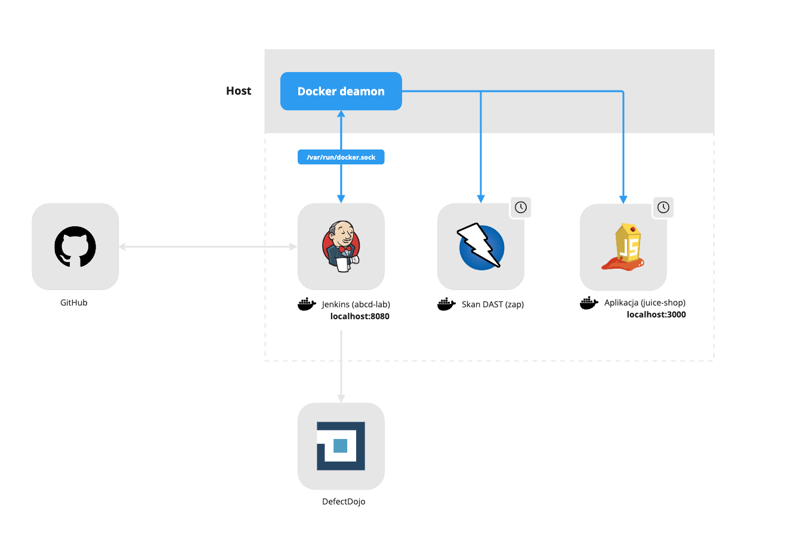

# Instalacja środowiska

- [Instalacja środowiska](#instalacja-środowiska)
  - [Wymagania](#wymagania)
  - [Obrazy Docker do pobrania](#obrazy-docker-do-pobrania)
  - [Pierwsze uruchomienie](#pierwsze-uruchomienie)
  - [Zarządzanie środowiskiem](#zarządzanie-środowiskiem)
- [Konfiguracja i zarządzanie bez Makefile](#konfiguracja-i-zarządzanie-bez-makefile)
- [Architektura laboratorium](#architektura-laboratorium)
  - [Docker](#docker)
  - [Preinstalowane narzędzia](#preinstalowane-narzędzia)


## Wymagania
Urchomienie laboratorium wymaga:
- Docker
- 10 GB pamięci RAM dostępnej dla Docker Desktop ([zobacz jak ustawić](https://docs.docker.com/desktop/settings/#advanced))
- Dostępny port `8080` na systemie hosta
- Możliwość uruchomienia `make`  - dla systemów "UNIX-like" nie będzie to problemem. Dla Windowsa potrzebujesz np. WSL

Jeżeli nie masz możliwości skorzystania z `make` to na końcu podajemy wszystkie komendy potrzebne do postawienia laboratorium bez Makefile.

## Obrazy Docker do pobrania

Aby przyspieszyć pracę pobierz za wczasu te dwa obrazy Dockera:
* Zed Attack Proxy (ZAP) - skaner DAST
* Juice Shop - testowa aplikacja, na której uruchomimy skan dynamiczny

```bash
docker pull ghcr.io/zaproxy/zaproxy:stable
docker pull bkimminich/juice-shop
```

## Pierwsze uruchomienie

Sklonuj na swój komputer to repozytorium.

Utwórz nowe środowisko: 
```text
make create-lab
```

> [!NOTE]
> Zrób sobie przerwę na dobrą kawę lub herbatę ☕️. W zależności od Twojego internetu pierwsze uruchomienie środowiska może zająć chwilę. W trakcie tworzenia laboratorium pobierany jest obraz `jenkins/jenkins:lts`, wszystkie narzędzia i zależności oraz pluginy.

W wyniku stworzenia laboratorium zostały utworzone 3 rzeczy: kontener, obraz oraz wolumen. Aby uruchomić środowisko lab wykonaj polecenie:
```text
make start-lab

[#ABCD]	Uruchamianie kontenera Docker...
abcd-lab
[#ABCD]	Kontener dostępny: http://localhost:8080
[#ABCD]	Hasło Jenkins: 1234567890foobarbaz
```

Przejdź na stronę [http://localhost:8080](http://localhost:8080) i odblokuj Jenkins za pomocą hasła, które znajduje się w outputcie z wykonania polecenia `make start-lab`. Nie musisz instalować żadnych dodatkowych pluginów w tym momencie. Twój username to `admin`.


Voila! Twój instancja laboratorium oparta o Jenkinsa jest gotowa do pracy! 

## Zarządzanie środowiskiem
Całość środowiska jest mozliwa do uruchomienia w prosty sposób dzięki zautomatyzowanym krokom zdefiniowanym w **Makefile**.

```text
make help

create-lab: Tworzy obraz Docker oraz wolumen
help:       Pokazuje pomoc
remove-lab: Usuwa kontener, wolumen oraz obaz
start-lab:  Uruchamia kontener Jenkins
stop-lab:   Stopuje kontener Jenkins
```

# Konfiguracja i zarządzanie bez Makefile
Sklonuj na swój komputer to repozytorium.

Zbuduj obraz:
```bash
docker build -t abcd-lab -f Dockerfile .
```

Stwórz wolumen aby środowisko mogło zachować dane:
```bash
docker volume create abcd-lab
```

Utwórz nowy kontener Docker z Jenkins: 
```bash
docker create --name abcd-lab \
  -p 8080:8080 \
  -v abcd-lab:/var/jenkins_home \
  -v /var/run/docker.sock:/var/run/docker.sock \
  abcd-lab
```
> [!NOTE]
> W przypadku problemów. Podmontowanie gniazda Docker na Windowsie może wymagać drobnej zmiany `-v //var/run/docker.sock:/var/run/docker.sock` zwróć uwagę na podwójny `//`.

Uruchom kontener:
```bash
docker start abcd-lab
```

Uzyskanie dostępu do hasła (użytkownik to `admin`):
```bash
docker exec -it abcd-lab cat /var/jenkins_home/secrets/initialAdminPassword
```

Usuwanie środowiska (kontener, wolumen, obrazś):
```bash
docker rm abcd-lab
docker volume rm abcd-lab
docker image rmi abcd-lab
```

# Architektura laboratorium


## Docker
> [!WARNING]
> Środowisko z którego korzystasz w trakcie laboratoriów jest zbudowane na **tylko i wyłącznie potrzeby lokalne do celów związanych z kursem**. Odwzorowanie tego środowiska w zastosowaniu produkcyjnym może powodować problemy związane z bezpieczeństwem.

Istotne koncepty:
- Aby uprościć architekturę cały potok CI jest uruchamiany na tzw. "built-in (master) node"
- Kontener z Jenkins ma podmontowany wolumen z gniazdem UNIX `/var/run/dokcer.sock` z systemu hosta zgodnie z wzorecem znanym jako *Docker-outside-of-Docker (DooD)*. Pozwala to potokowi CI na uruchomienie kontenerów-rodzeństwa (*sibling containers*) za pomocą deamona Dockera działajacego na hoście.
    - Zed Attack Proxy `zap` - kontener uruchamiany w trakcie skanu analizy dynamicznej oraz natychmiast stopowany i usuwany po zakończeniu pracy.
    - Juice Shop `juice-shop` - kontener z aplikacają uruchomiany w trakcie skanu analizy dynamicznej oraz natychmiast stopowany i usuwany po zakończeniu skanu.
      - Aplikacja z racji tego, że jest skontenryzowana jest osiągalna przez `zap` poprzez specjalny adres `host.docker.internal:3000`.
- Jenkins działa jako root aby zapewnić dostęp do gniazda UNIXowego podmonotwane z systemu hosta.

## Preinstalowane narzędzia
Aby przyspieszyć pracę z laboratorium w trakcie budowania obrazu Docker instalowane są wszystkie narzędzia oraz pluginy do Jenkins, które będą używane w trakcie pracy.
