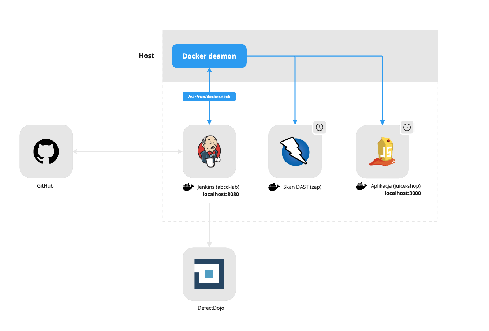

# Architektura laboratorium

## Docker
> [!WARNING]
> Środowisko z którego korzystasz w trakcie laboratoriów jest zbudowane na **potrzeby lokalne do celów związanych z kursem**. Odwzorowanie tego środowiska w zastosowaniu produkcyjnym może powodować problemy związane z bezpieczeństwem.

Istotne koncepty:
- Aby uprościć architekturę cały potok CI jest uruchamiany na tzw. "built-in (master) node"
- Kontener z Jenkins ma podmontowany wolumen z gniazdem UNIX `/var/run/dokcer.sock` z systemu hosta zgodnie z wzorecem znanym jako *Docker-outside-of-Docker (DooD)*. Pozwala to potokowi CI na uruchomienie kontenerów-rodzeństwa (*sibling containers*) za pomocą deamona Dockera działajacego na hoście.
    - Zed Attack Proxy `zap` - kontener uruchamiany w trakcie skanu analizy dynamicznej oraz natychmiast stopowany i usuwany po zakończeniu pracy.
    - Juice Shop `juice-shop` - kontener z aplikacają uruchomiany w trakcie skanu analizy dynamicznej oraz natychmiast stopowany i usuwany po zakończeniu skanu.
      - Aplikacja z racji tego, że jest skontenryzowana jest osiągalna przez `zap` poprzez specjalny adres `host.docker.internal:3000`.
- Jenkins działa jako root aby zapewnić dostęp do gniazda UNIXowego podmonotwane z systemu hosta.

## Preinstalowane narzędzia
Aby przyspieszyć pracę z laboratorium w trakcie budowania obrazu Docker instalowane są wszystkie narzędzia oraz pluginy do Jenkins, które będą używane w trakcie pracy.
